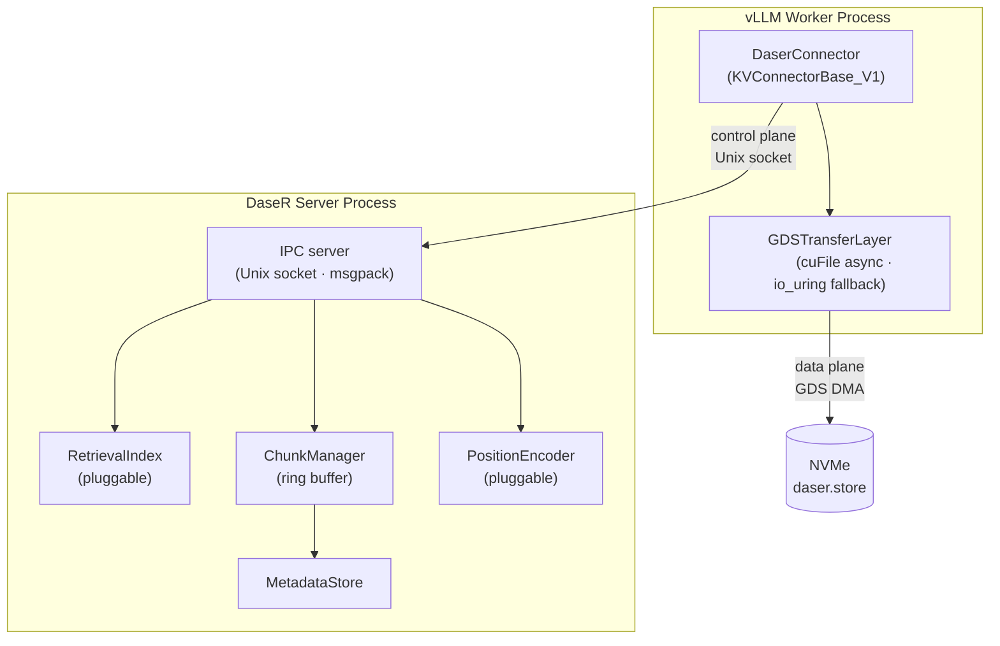

# DaseR Architecture

DaseR is a RAG-native KV cache service for LLM inference. It runs as an independent server process and integrates with vLLM via the `KVConnectorBase_V1` interface, storing KV tensors directly to NVMe using NVIDIA cuFile (GDS) or io_uring as a fallback.

---

## Process Topology

DaseR uses a two-process design: the **data plane** runs inside the vLLM worker process; the **control plane** runs in a separate DaseR server process.



**Why the split?**
`cuFileBufRegister` binds GPU memory to the calling process's CUDA context. Cross-process GPU access adds unacceptable latency on the hot path. GDS DMA therefore stays in the vLLM process (which owns the CUDA context), while index management and metadata stay in the DaseR server.

---

## Component Responsibilities

| Component | Process | Responsibility |
|-----------|---------|----------------|
| `DaserConnector` | vLLM | Implements `KVConnectorBase_V1`; dispatches GDS IO; calls DaseR server over IPC for metadata |
| `GDSTransferLayer` | vLLM | cuFile async read/write; io_uring fallback; backend selected once at startup |
| `IPCServer` | DaseR | Handles `lookup`, `alloc_chunk`, `commit_chunk`, `evict_chunk` over Unix socket |
| `RetrievalIndex` | DaseR | Pluggable retrieval interface; first implementation: exact prefix hash (`PrefixHashIndex`) |
| `ChunkManager` | DaseR | Ring buffer slot allocation and eviction over a single pre-allocated NVMe file |
| `MetadataStore` | DaseR | In-memory index; serialized to `daser.index` on shutdown, restored on startup |
| `PositionEncoder` | DaseR | Records and applies position offsets per chunk; pluggable strategy |

---

## Storage Layout

DaseR pre-allocates a single large file (`daser.store`) on an XFS volume. The file is a flat ring buffer of fixed-size slots; all metadata lives separately in memory.

```
daser.store  (ring buffer of fixed-size slots)
┌──────┬──────┬──────┬──────┬──────┬──────┐
│  s0  │  s1  │  s2  │  s3  │  s4  │  s5  │  ...
└──────┴──────┴──────┴──────┴──────┴──────┘
 ←── chunk A ──→        ←── chunk B ──→

daser.index  (msgpack snapshot of in-memory index)
```

Slot size is fixed at startup from model config (`num_kv_heads × head_dim × layers × block_tokens × dtype_bytes`). A chunk spans one or more contiguous slots. The ring buffer evicts the oldest chunk when space is needed.

---

## Request Lifecycle

1. **Scheduler** calls `get_num_new_matched_tokens()` → connector sends `lookup` to DaseR server → returns matching `ChunkMeta` list.
2. **Worker** calls `start_load_kv()` → `GDSTransferLayer` issues cuFile reads for all layers concurrently → awaits completion → copies staging buffers into the KV cache. Returns synchronously (required for CUDA graph compatibility).
3. **Forward pass** runs (FULL graph replay or prefill).
4. **Worker** calls `save_kv_layer()` per layer → cuFile writes issued asynchronously → `wait_for_save()` awaits all writes.
5. **Worker** calls `request_finished()` → connector sends `commit_chunk` to DaseR server → index updated.

---

## Pluggable Interfaces

**`RetrievalIndex`** — decouples lookup strategy from storage. Current implementation: `PrefixHashIndex` (exact SHA-256 prefix match). Future: semantic / vector retrieval.

**`PositionEncoder`** — decouples position offset strategy from the rest of the system. Current implementation: `FixedOffsetEncoder` (returns stored offset unchanged). Future: dynamic re-encoding for cross-context reuse.

---

## GDS Backend Selection

`GDSTransferLayer` probes for cuFile availability once at startup and selects a backend immutably:

| Backend | Condition | Data path |
|---------|-----------|-----------|
| `CuFileBackend` | cuFile available + XFS volume | GPU ↔ NVMe direct DMA (no CPU) |
| `IOUringBackend` | fallback | GPU → CPU bounce → io_uring → NVMe |

The active backend is logged at startup: `[GDS] backend=cufile` or `[GDS] backend=io_uring`.
