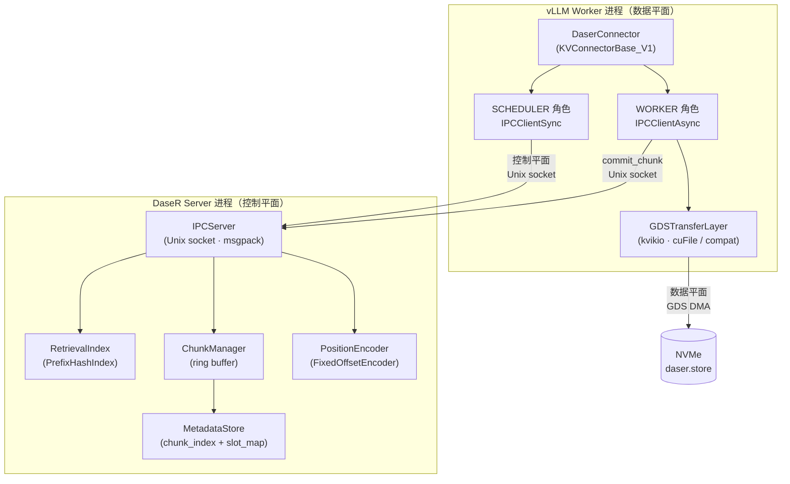
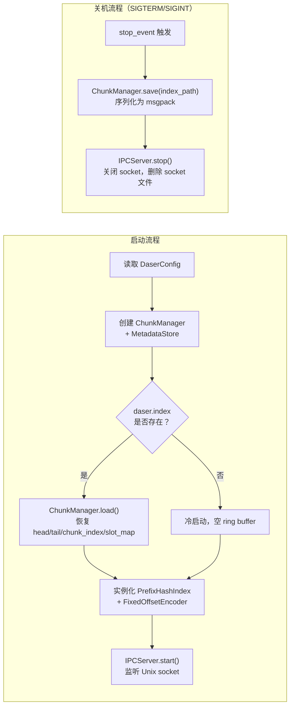

# 整体方案

DaseR 是面向 LLM 推理的 RAG-native KV 缓存服务。它以独立进程运行，通过 `KVConnectorBase_V1` 接口与 vLLM 集成，利用 NVIDIA cuFile（GDS）或 io_uring 将 KV 张量直接存储到 NVMe。

---

## 进程拓扑

DaseR 采用双进程设计：**数据平面**运行在 vLLM Worker 进程中，**控制平面**运行在独立的 DaseR Server 进程中。

**双进程的原因**：`cuFileBufRegister` 将 GPU 内存绑定到调用进程的 CUDA context。跨进程 GPU 访问在热路径上会引入不可接受的延迟，因此 GDS DMA 必须在持有 CUDA context 的 vLLM 进程内执行，而索引管理和元数据保存在独立的 DaseR 进程中。

---

## 关键设计决策

### start_load_kv 全量同步加载

**问题**：vLLM 在 FULL CUDA graph 模式下执行 decode 步时，graph replay 不会重新执行 Python 代码，`wait_for_layer_load` 钩子不会被调用。

**方案**：`start_load_kv` 一次性提交所有层的读取并阻塞等待，返回前完成所有 staging buffer → KV cache 的拷贝。`wait_for_layer_load` 变为 no-op。

### 后台 asyncio 循环（daser-io 线程）

**问题**：vLLM Worker 本身可能运行在 asyncio 事件循环中，`run_until_complete` 不可重入。

**方案**：WORKER 角色在构造时启动独立的后台线程 `daser-io`，运行专属 asyncio loop。所有 GDS 协程通过 `run_coroutine_threadsafe` 提交，通过 `Future.result()` 阻塞等待，完全隔离。

### 两阶段提交（alloc → commit）

**目的**：防止部分写入的 chunk 被其他请求读到。

- `alloc_chunk`：在 `MetadataStore` 中预留 slot，但不插入 `RetrievalIndex`
- GDS 写入完成后，`commit_chunk`：调用 `RetrievalIndex.insert(meta)`，chunk 才对外可见

### 环形 buffer wrap-around

当 `head` 到达 buffer 末尾且剩余空间不足以放下一个 chunk 时：
1. 调用 `_evict_range` 驱逐末尾区域内的 chunk
2. 插入 SKIP 块填充末尾碎片
3. `head` 回绕到 0，从头开始分配

### GDS backend 选择

启动时通过 `kvikio.defaults.get("compat_mode")` 一次性选定，之后不可切换：

| Backend | 条件 | 数据路径 |
|---------|------|---------|
| `GDS` | `compat_mode=OFF` + XFS + cuFile 可用 | GPU ↔ NVMe 直接 DMA，不经 CPU |
| `COMPAT` | 其他情况 | GPU → CPU bounce → POSIX 线程池 → NVMe |

---

## 启动与关机

