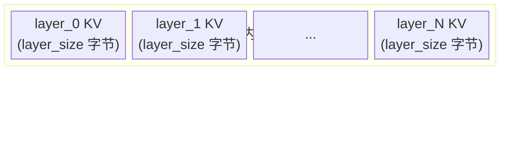

# 组件详解

## 组件职责

| 组件 | 进程 | 职责 |
|------|------|------|
| `DaserConnector` | vLLM | 实现 `KVConnectorBase_V1`；分 SCHEDULER/WORKER 两种角色 |
| `GDSTransferLayer` | vLLM | 封装 kvikio，提供 cuFile 异步 DMA（或 compat 模式降级）；启动时选定 backend，不可切换 |
| `IPCClientSync` | vLLM (SCHEDULER) | 阻塞式 Unix socket 客户端，用于 lookup / alloc_chunk |
| `IPCClientAsync` | vLLM (WORKER) | asyncio Unix socket 客户端，用于 commit_chunk |
| `IPCServer` | DaseR | 处理 4 种 op：`lookup` / `alloc_chunk` / `commit_chunk` / `evict_chunk` |
| `ChunkManager` | DaseR | 环形 buffer 的 slot 分配、淘汰与持久化 |
| `MetadataStore` | DaseR | 内存索引：`chunk_index`（key→ChunkMeta）和 `slot_map`（slot_id→SlotEntry） |
| `RetrievalIndex` | DaseR | 可插拔检索接口；当前实现：`PrefixHashIndex`（SHA-256 精确前缀匹配） |
| `PositionEncoder` | DaseR | 可插拔 position offset 策略；当前实现：`FixedOffsetEncoder`（固定 offset=0） |

---

## 存储布局

DaseR 在 XFS 卷上预分配一个大文件 `daser.store`，作为固定 slot 大小的环形 buffer。




**slot 大小**（字节）= `num_kv_heads × head_dim × num_layers × block_tokens × dtype_bytes`

**文件偏移计算**：
```
file_offset(slot_i, layer_idx) = slot_i × slot_size + layer_idx × layer_size
```

环形 buffer 的 `slot_map` 记录每个 slot 的状态：
- `chunk`：chunk 的第一个 slot，存 chunk_key 和 num_slots
- `cont`：chunk 的后续 slot（第 1..n-1 个）
- `skip`：wrap-around 时末尾不足以放下一个 chunk 时填充的跳过块

`daser.index` 为 msgpack 快照，关机时保存、启动时恢复，包含 ring buffer 的 `head`、`tail`、`chunk_index` 和 `slot_map`。

---

## 可插拔接口

### RetrievalIndex

```python
class RetrievalIndex(ABC):
    async def lookup(tokens, model_id) -> list[ChunkMeta]  # 查缓存
    async def insert(meta: ChunkMeta)                       # commit 后写入
    async def remove(chunk_key: str)                        # evict 时删除
```

**当前实现：PrefixHashIndex**

- 内部维护 `dict[str, ChunkMeta]`，key 为 `SHA256(token_ids)`
- `lookup` 从最长前缀向短试（步长 = `block_tokens`），返回第一个命中
- 未来可替换为向量相似度检索（语义 KV 复用）

### PositionEncoder

```python
class PositionEncoder(ABC):
    def assign_offset(chunk_key, token_count) -> int  # alloc 时调用，返回存储的 offset
    def get_offset(meta: ChunkMeta) -> int            # load 时调用，返回应用的 offset
```

**当前实现：FixedOffsetEncoder**

- 构造时指定 `fixed_offset`（当前为 0）
- `assign_offset` 始终返回该固定值
- `get_offset` 直接返回 `meta.pos_offset`

**插入新实现**：在 `daser/server/__main__.py` 中替换实例化，`IPCServer` 仅依赖 ABC 接口。

---

## IPC 协议

**传输层**：Unix socket + 4 字节大端长度前缀 + msgpack body。每次调用独立连接，无连接复用。

| op | 方向 | 请求字段 | 响应字段 |
|----|------|----------|----------|
| `lookup` | SCHEDULER→Server | `tokens`, `model_id` | `chunks: list[dict]` |
| `alloc_chunk` | SCHEDULER→Server | `chunk_key`, `token_count`, `model_id` | `start_slot`, `num_slots`, `file_offset`, `pos_offset` |
| `commit_chunk` | WORKER→Server | `chunk_key` | `ok: true` |
| `evict_chunk` | SCHEDULER→Server | `chunk_key` | `ok: true` |

SCHEDULER 使用 `IPCClientSync`（阻塞 socket）；WORKER 使用 `IPCClientAsync`（asyncio）。
