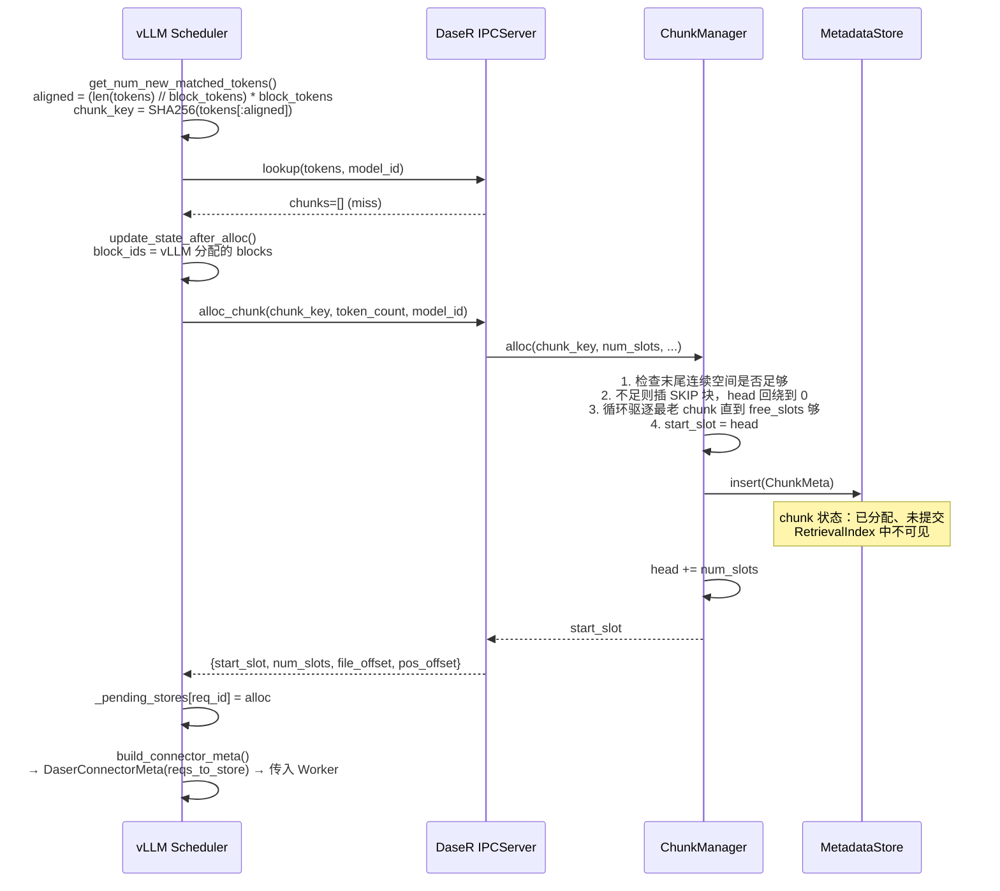
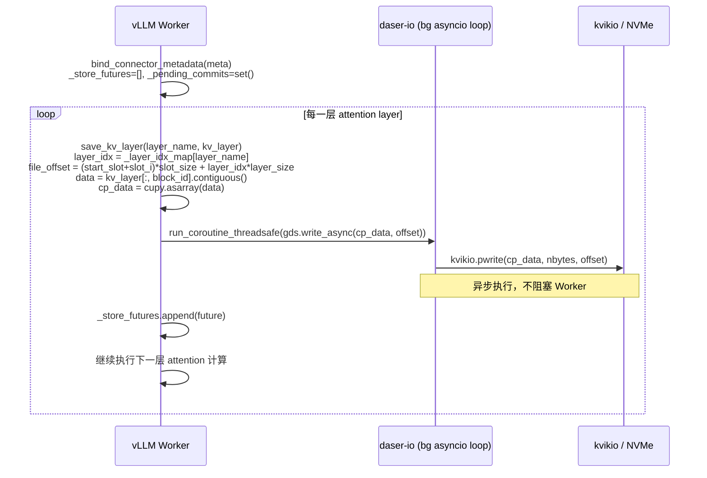
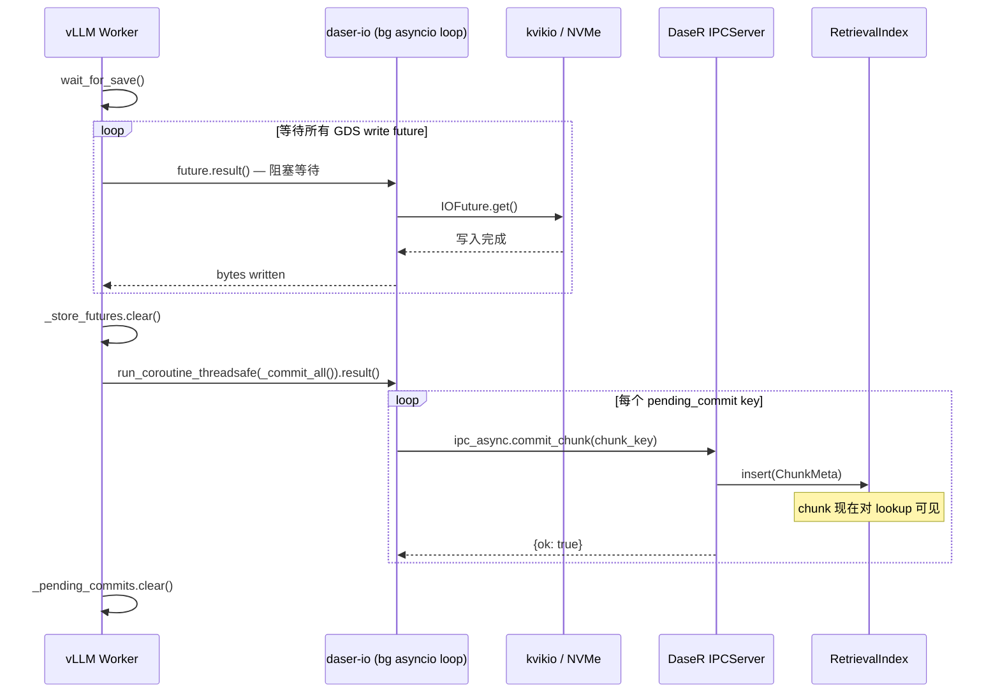
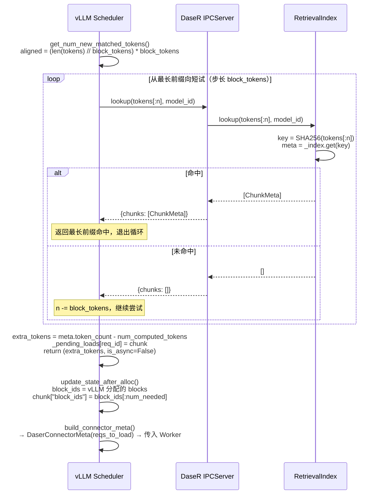
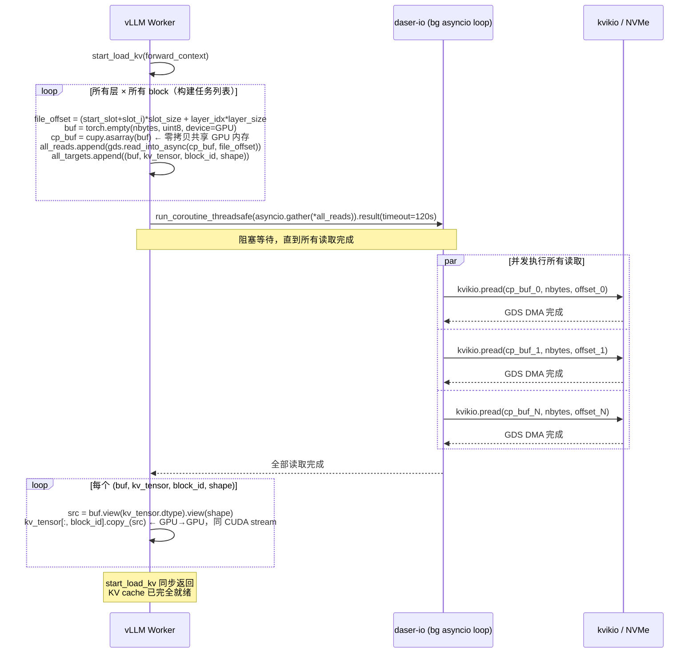
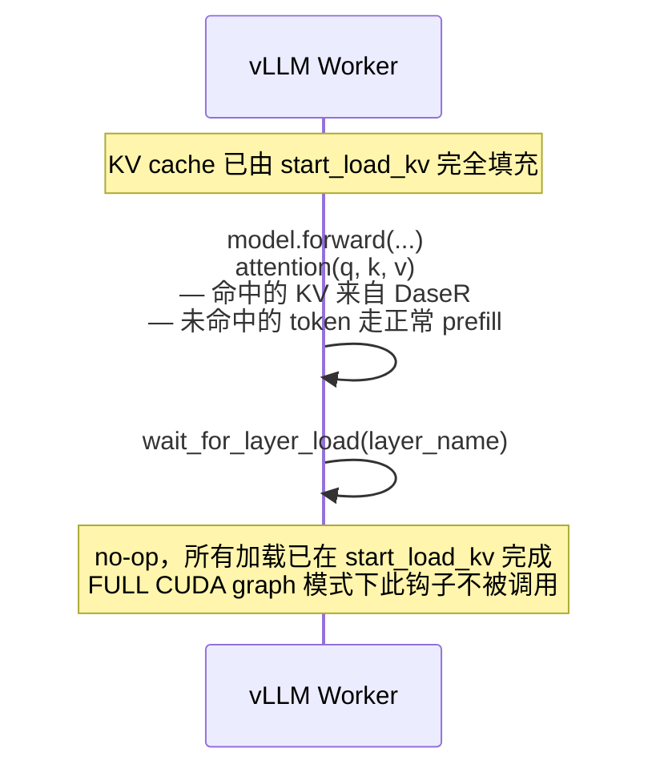

# 数据流程

## KV Store 流程（Cache Miss，新写入）

当 vLLM 调度器发现某个请求在 DaseR 中没有命中缓存，走 **store 路径**，将新计算出的 KV 持久化到 NVMe。

### 阶段一：Scheduler — 查找未命中并分配 slot

### 阶段二：Worker — Forward Pass 中逐层异步写入

> 每层的 GDS write 提交到后台 `daser-io` 线程的 asyncio loop，与 forward pass 并发执行，不阻塞推理。

### 阶段三：Worker — 等待写完并两阶段提交

> `commit_chunk` 是两阶段提交的第二步——GDS 写完成后 chunk 才通过 `RetrievalIndex.insert()` 对外可见，防止部分写入的数据被读到。

---

## KV Load 流程（Cache Hit，加载缓存）

当 vLLM 调度器发现某个请求在 DaseR 中有命中缓存，走 **load 路径**，将 NVMe 上的 KV 读回 GPU。

### 阶段一：Scheduler — 查找命中

> `is_async=False`：vLLM 在同一调度步内执行 forward pass，KV 必须在 forward 开始前完全就绪。

### 阶段二：Worker — 并发读取所有层（start_load_kv，同步阻塞）

> 所有层、所有 block 的读取通过 `asyncio.gather` 并发提交，充分利用 NVMe 队列深度。`start_load_kv` 全量同步完成后返回，`wait_for_layer_load` 为 no-op，保证 CUDA graph 兼容性。

### 阶段三：Forward Pass

