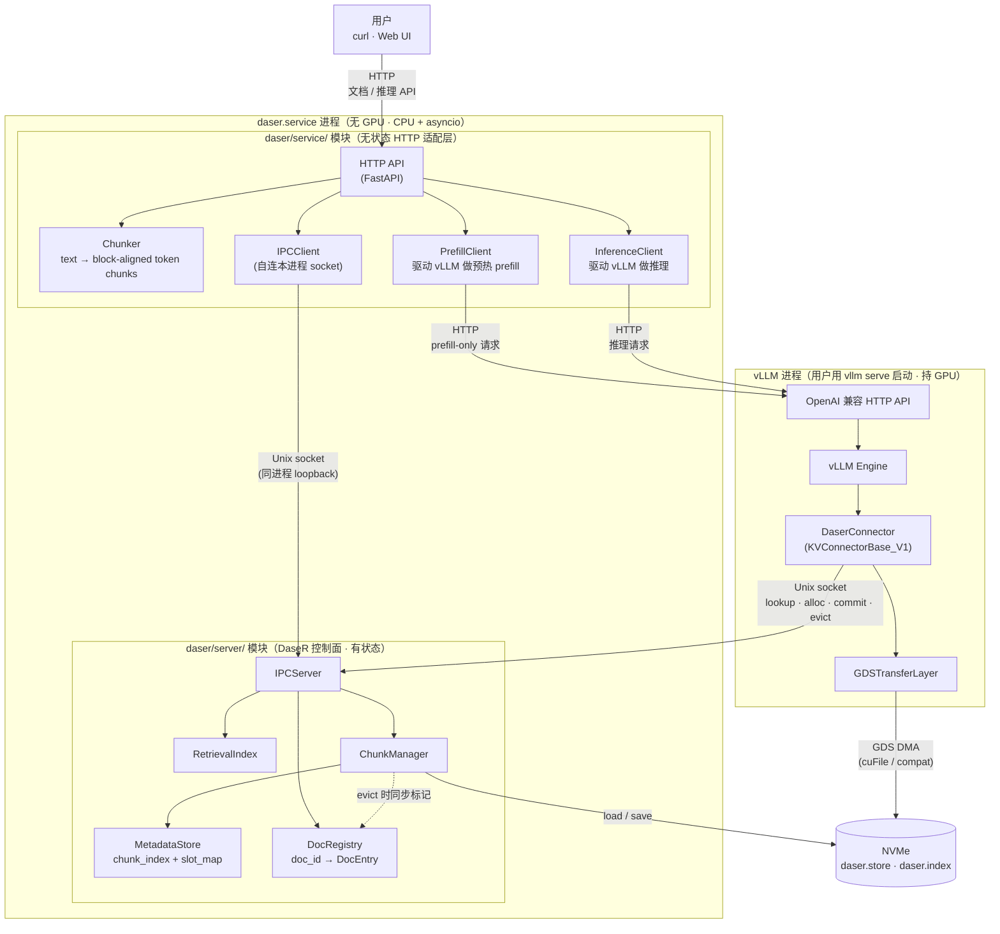
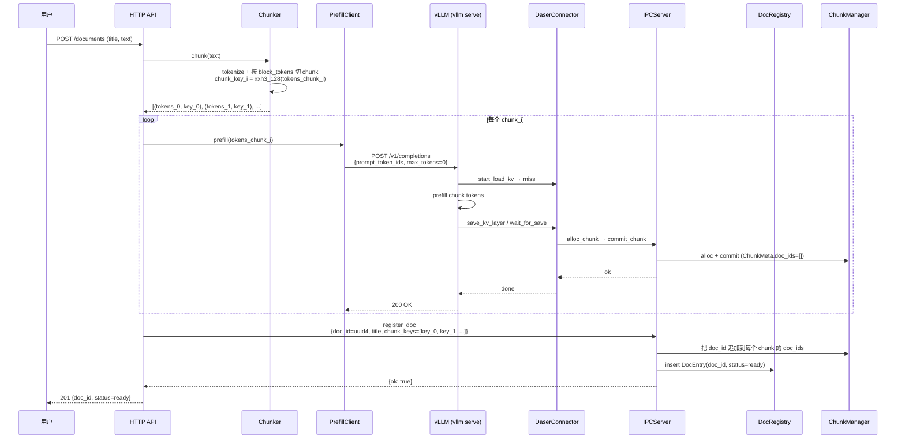
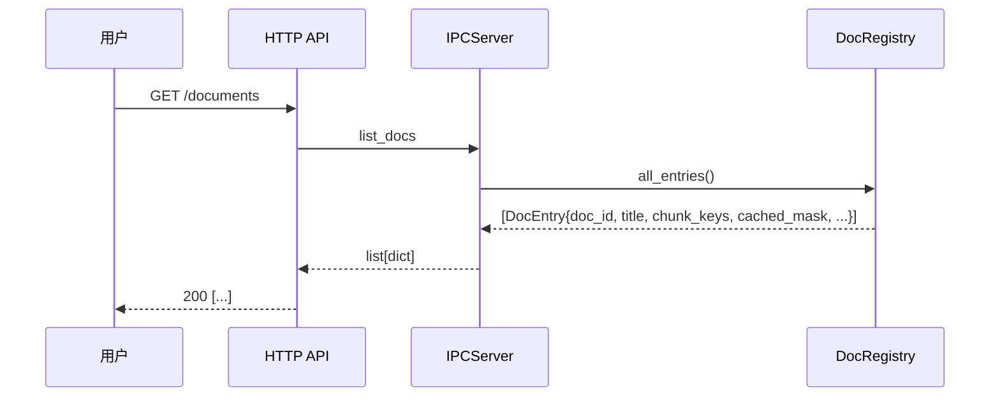
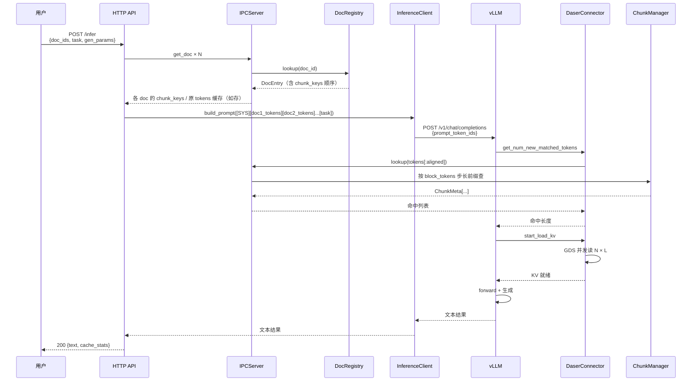

# 服务层设计

本文档描述 DaseR 项目的用户侧服务层（Service Layer）设计。服务层位于现有 KV 缓存基础设施之上，为终端用户提供文档管理与 RAG 推理能力。

---

## 一、目标与范围

### 目标

服务层是一个**演示级 RAG 服务**，对终端用户提供三类操作：

1. **上传文档** — 把文档交给系统，系统负责切块、分词、离线预计算 chunk-level KV 并写入 DaseR。
2. **列举文档** — 返回当前已注册的文档清单与状态（含哪些 chunk 仍被缓存）。
3. **指定文档 + task 推理** — 用户选定一组 doc_id 与 task 提示词，服务构造 prompt 并调用 vLLM 完成推理；被选中的文档 chunk 从 DaseR 缓存中加载 KV，避免重复 prefill。

### 范围外（不做）

| 项目 | 原因 |
|------|------|
| 多租户 / 权限隔离 | 单机单用户的演示服务，无需 auth |
| 语义检索（embedding 检索 doc） | 用户显式指定 doc_id，不需要向量检索 |
| Composition-aware caching / CacheBlend | Research roadmap Contribution 2，服务层只提供承接接口，不落实现 |
| 文档跨进程热更新 | 上传后不可变；更新等于删除 + 重新上传 |

### 与 research roadmap 的关系

- 服务层**不涉及** I/O 调度（Contribution 1）——它只是上层驱动者，不触碰 `GDSTransferLayer`。
- 服务层**为** composition-aware caching（Contribution 2）**准备数据基础**：独立 chunk KV 的离线预计算、文档→chunk 的映射、组合访问的埋点接口都在这一层。
- 服务层**不做** cost-based 动态决策（Contribution 3），此类策略后续在 `ChunkManager` / 新的策略模块中实现。

---

## 二、进程拓扑

**两进程部署**：Service 进程与 DaseR 控制面合并；vLLM 由用户用 `vllm serve` 单独启动。



### 启动顺序（用户侧）

用户只需依序启动两个进程：

```bash
# 1. vLLM（配好 DaserConnector）
vllm serve <model-path> \
    --kv-transfer-config '{"kv_connector":"DaserConnector", ... }' \
    --port 8001

# 2. Service（同一进程内启动 HTTP API + DaseR IPCServer + 控制面）
python -m daser.service \
    --host 0.0.0.0 --port 8080 \
    --vllm-base-url http://127.0.0.1:8001 \
    --store-path /path/to/daser.store \
    --socket-path /tmp/daser.sock \
    --index-path /tmp/daser.index \
    --model-id <model-id> --tokenizer <tokenizer>
```

> 向后兼容：如需保留"纯 DaseR 控制面进程"入口（不起 HTTP），`python -m daser.server` 仍可独立运行，供测试或高级用户使用。

### 拓扑要点

| 维度 | 决策 |
|------|------|
| **进程边界** | Service + DaseR 控制面合并；vLLM 独立 |
| **代码边界** | `daser/service/` 与 `daser/server/` 仍然是两个模块；互相通过公开 API（IPCServer 的启停 / IPCClient 的 IPC 协议）交互，不互相 import 私有成员 |
| **状态归属** | **所有状态（chunk + doc）在 `daser/server/`**；`daser/service/` 无本地持久化 |
| **IPC 通路** | Service 模块调 DaseR 控制面时走 Unix socket 自连（loopback），保持 IPC 协议作为唯一接口；vLLM DaserConnector 通过同一 socket 连接（与现状一致） |
| **CUDA 依赖** | Service 进程**不依赖** CUDA / vLLM Python 包，可跑在无 GPU 节点（只要能 HTTP 到 vLLM） |

### 为什么代码仍分 `daser/service/` 和 `daser/server/`

| `daser/server/` | `daser/service/` |
|-----------------|------------------|
| **有状态**：ChunkManager / MetadataStore / RetrievalIndex / DocRegistry；`daser.index` 持久化 | **无状态**：HTTP 路由 / 参数校验 / Chunker / vLLM HTTP 客户端 / IPC 客户端 |
| 被多种客户端消费：vLLM 的 DaserConnector（现存）、Service 模块（新增）、潜在的 CLI / 测试夹具 | 只服务 HTTP 用户；不会被 vLLM 消费 |
| 抽象层级：**chunk / slot / token 级** | 抽象层级：**document / task / prompt 级** |
| 修改频率：稳定（KV 基础设施） | 修改频率：高（API 迭代） |

将来如需把 Service 拆到前端节点（例如多台 Service 连同一个 DaseR），只改启动脚本，代码零改动。

---

## 三、模块组件

### 3.1 `daser/service/` 新增模块（无状态）

| 组件 | 职责 |
|------|------|
| `HTTP API` | FastAPI 暴露 REST 端点；请求路由；参数校验 |
| `Chunker` | 文本 → token → block_tokens 对齐的 token chunk 列表；计算 chunk_key |
| `PrefillClient` | 对 vLLM 发起 prefill-only 请求（`max_tokens=0` 或等价），触发 DaserConnector 的 alloc→write→commit 链路，使 chunk KV 落盘 DaseR |
| `InferenceClient` | 对 vLLM 发起正常 completion 请求；按模板拼接 prompt |
| `IPCClient` | Unix socket 客户端，调 DaseR 控制面的 `register_doc` / `list_docs` / `get_doc` / `evict_doc`（新 op），以及间接确认 chunk 状态 |

所有模块放在 `daser/service/` 下，**不得跨层直接 import `daser/server/` 或 `daser/connector/` 私有成员**——服务模块只通过 HTTP（对 vLLM）和 Unix socket（对 DaseR 控制面）与数据/控制面交互。

### 3.2 `daser/server/` 扩展（新增 & 修改）

| 组件 | 变更 |
|------|------|
| `MetadataStore.ChunkMeta` | **新增字段** `doc_ids: list[str]`；默认空，由 `register_doc` 写入。支持一个 chunk 被多个 doc 共享（避免重复上传重新计算） |
| `DocRegistry`（新） | `doc_id → DocEntry`：`{title, created_at, token_count, chunk_keys: list[str], status}`；随 `daser.index` 一起 msgpack 落盘 |
| `ChunkManager` | `evict(chunk_key)` 在驱逐时同步通知 `DocRegistry`，把受影响 doc 的该 chunk 标记为 evicted（保留 key 顺序，不真删） |
| `IPCServer` | 新增 4 个 op：`register_doc` / `list_docs` / `get_doc` / `evict_doc`（详见第七节的 IPC 协议扩展） |

### 3.3 不变的组件

- `DaserConnector`（vLLM 侧）：照旧响应 vLLM 的 save/load 钩子；不感知 doc_id。
- `GDSTransferLayer`：无变化。
- `RetrievalIndex` / `PositionEncoder`：可插拔接口不变。

> **设计要点**：预热 prefill 走的是 vLLM 的正常 forward pass；DaserConnector 在 save 路径里把 KV 写入 DaseR，但它写入的 ChunkMeta 不含 doc_id。**Service 在所有 chunk 都 commit 完毕后，调用 `register_doc` 把这些 chunk_keys 绑定到新 doc_id**——这是 doc 和 chunk 关系的唯一写入点。

---

## 四、核心数据流

### 4.1 上传流程



**关键点**：
- `chunk_key = xxh3_128(tokens_chunk_i)` 与 DaseR 的 `PrefixHashIndex` key 一致（参见 `daser/connector/daser_connector.py` 与 `daser/retrieval/prefix.py`）。
- 每个 chunk **独立** prefill（不拼前缀），对应"独立 chunk KV（CacheBlend 式）"的预计算语义。
- `register_doc` 是**原子登记点**：必须所有 chunk 都 commit 成功后再发。若中途失败，Service 不发 `register_doc`，chunk 照旧躺在 DaseR ring buffer 里——它们仍可能被将来的同文本上传复用（doc_ids 为空的 chunk 依然是有效缓存）。

### 4.2 列举流程



每次列举都走 IPC，拿到**当前真实状态**（包括哪些 chunk 已被 ring buffer 驱逐）。Service 端不缓存。

### 4.3 推理流程



> 独立 chunk KV 命中后，vLLM 加载的 KV **不含交叉注意力**；这对当前 demo 足够（定性验证流水线），精修由后续 CacheBlend / composition-aware caching 处理。
>
> 注：上图里 Service 需要能"根据 doc_id 拿回原文 tokens"以拼 prompt。为此 `DocEntry` 里除 chunk_keys 外还要保留**拼接用的 token 序列**（或保留原文 text，再用 tokenizer 复算）。实现上两种都可，第八节"DocEntry 是否缓存原 tokens"条目给出选型说明。

---

## 五、文档分块策略

分块是服务层的核心决策，直接影响 DaseR 缓存命中率。

**规则（初版）**：

1. 用 tokenizer 把文档文本转成 `token_ids`。
2. 按 `block_tokens`（与 vLLM / DaseR 一致，默认 16）对齐切块；**不足一个 block 的尾部 token 丢弃或填到下一个 chunk**——具体策略待定。
3. 每个 chunk 固定为 `N × block_tokens` 个 token（`N` 为可配置的每 chunk 块数；初版建议 `N = chunk_tokens / block_tokens`）。
4. `chunk_key = xxh3_128(tokens_chunk_i)` —— 与 DaseR 现有 `PrefixHashIndex` 完全对齐。

**待迭代**（见第八节）：语义切块、跨句不截断、markdown/heading 感知、chunk_tokens 大小选择、尾部 token 处理。

---

## 六、持久化

**单一真源**：所有 doc / chunk 元数据都在 DaseR 控制面，Service 无本地文件。

### 6.1 ChunkMeta（扩展）

```python
@dataclass
class ChunkMeta:
    chunk_key: str
    start_slot: int
    num_slots: int
    token_count: int
    pos_offset: int
    model_id: str
    doc_ids: list[str]  # 新增：哪些 doc 用到了这个 chunk（可为空）
```

### 6.2 DocEntry（新）

```python
@dataclass
class DocEntry:
    doc_id: str                 # uuid4
    title: str
    created_at: float
    token_count: int            # 原文 token 总数
    chunk_keys: list[str]       # 保留上传时的顺序；永不重排
    cached_mask: bytes | bitset # 位图：1=still cached, 0=evicted
    status: str                 # "ready" | "partial" | "failed"
    tokens: list[int] | None    # 可选：拼接 prompt 用的 token 序列（详见第八节）
    error: str | None           # 失败原因
```

### 6.3 落盘

- `DocRegistry` 的 `doc_id → DocEntry` 字典在 **`ChunkManager.save(index_path)` 时一起 msgpack 序列化**，写入 `daser.index`。
- 启动时 `ChunkManager.load(index_path)` 顺带恢复 DocRegistry；与 chunk_index / slot_map 的恢复在同一原子路径里，不会出现 doc 恢复了但 chunk 没恢复的错位。
- `cached_mask` 在 ChunkManager 驱逐 chunk 时同步翻转；这些状态自然被下一次 save 持久化。

### 6.4 驱逐的级联效应

- `ChunkManager.evict(chunk_key)` 除了更新 slot_map、从 RetrievalIndex 删除外，还要：
  1. 读 `ChunkMeta.doc_ids`
  2. 对每个 doc_id：在 `DocRegistry[doc_id].cached_mask` 里把对应 chunk 位清 0
  3. 若 doc 的 `cached_mask` 全 0 → status 标记为 `"evicted"`（仍保留条目，可由用户主动 DELETE）
- `evict_doc(doc_id)` 反向：遍历 `DocEntry.chunk_keys`，逐个调用 `evict_chunk`（若该 chunk 的 doc_ids 只剩这一个就真评 chunk；否则只从 doc_ids 中移除）。

---

## 七、HTTP API & IPC 协议扩展

### 7.1 HTTP 端点一览

| 方法 | 路径 | 说明 |
|------|------|------|
| `POST` | `/documents` | 上传一个文档 |
| `GET` | `/documents` | 列举所有文档 |
| `GET` | `/documents/{doc_id}` | 单个文档详情（含 cached_mask / 驱逐状态）|
| `DELETE` | `/documents/{doc_id}` | 删除文档（级联驱逐专属 chunk）|
| `POST` | `/infer` | 指定 doc_ids + task 做推理 |
| `GET` | `/health` | 健康检查（含 vLLM / DaseR 可达性）|

### 7.2 HTTP 请求/响应 schema（初稿）

**POST `/documents`**

```json
// Request
{ "title": "string", "text": "string" }
// Response 201
{ "doc_id": "uuid", "status": "ready", "chunk_count": 8 }
```

**GET `/documents`**

```json
// Response 200
[
  {
    "doc_id": "uuid",
    "title": "string",
    "token_count": 1234,
    "chunk_count_total": 8,
    "chunk_count_cached": 5,
    "status": "partial",
    "created_at": 1690000000.0
  }
]
```

**GET `/documents/{doc_id}`** — 追加 `chunk_keys` 与 `cached_mask` 字段。

**POST `/infer`**

```json
// Request
{
  "doc_ids": ["uuid", "uuid"],
  "task": "Summarize the above documents.",
  "gen_params": { "max_tokens": 256, "temperature": 0.7 }
}
// Response 200
{
  "text": "string",
  "prompt_tokens": 5120,
  "completion_tokens": 256,
  "cache_hit_chunks": 16
}
```

### 7.3 IPC 协议扩展（新 4 个 op）

| op | 方向 | 请求字段 | 响应字段 |
|----|------|----------|----------|
| `register_doc` | Service→Server | `doc_id`, `title`, `chunk_keys: list[str]`, `token_count`, `tokens?: list[int]` | `ok: true` 或 `error` |
| `list_docs` | Service→Server | — | `docs: list[dict]`（每项含 cached_count / total_count） |
| `get_doc` | Service→Server | `doc_id` | `doc: dict`（含 chunk_keys + cached_mask + tokens?）|
| `evict_doc` | Service→Server | `doc_id` | `ok: true` |

现有 4 个 op（`lookup` / `alloc_chunk` / `commit_chunk` / `evict_chunk`）保持不变。

> `evict_chunk` 的既有语义不变；现在还要多做一件事：**读 `ChunkMeta.doc_ids`，反查 DocRegistry 翻转 cached_mask**。这属于 server 内部实现细节，不破坏 IPC 契约。

### 7.4 待细化

- 是否支持流式返回（SSE）？
- 上传是否支持文件 multipart？
- `gen_params` 的白名单 / 透传策略
- prompt 模板的可配置性
- 错误码与错误响应体

---

## 八、待决事项与开放问题

| 项目 | 问题 | 当前倾向 |
|------|------|---------|
| **预热 prefill 调用形式** | `vllm serve` 对 `max_tokens=0` 的支持与 DaserConnector 触发行为需实测；若 OpenAI API 层拦住，需退回 `max_tokens=1` 丢弃输出 | 先走 `max_tokens=0`，测不通再退回 |
| **Chunker 策略** | 是否跨句截断？markdown 感知？chunk_tokens 大小？尾部不足处理？| 初版最朴素：按 `chunk_tokens = N × block_tokens` 硬切，尾部丢弃 |
| **token prefix 对齐** | `alloc_chunk` key 为 `xxh3_128(tokens_chunk)`；推理时 `lookup` 用 `xxh3_128(tokens[:aligned])`。预热时 chunk 单独 prefill，推理时是拼接 prompt，两者 key 不自然一致 | 需确认 key 计算口径或调整预热/推理的 prompt 构造方式 |
| **DocEntry 是否缓存原 tokens** | 推理时要拼 prompt，需要拿回原文 tokens。方案 A：DocEntry 存 tokens（msgpack，占空间）；方案 B：只存原文 text + tokenizer 复算 | 初版存 tokens（省推理延迟，daser.index 多占几 MB 可接受）|
| **Prompt 模板位置** | `[SYS]` 是写死还是可配置？task 前是否需要分隔符？| 初版写死，在 Service 启动参数提供覆盖 |
| **多文档顺序** | 用户给的 doc_ids 顺序决定 prompt 顺序，命中率受 order 影响 | 初版严格按用户给定顺序；未来靠 composition-aware caching 打破 |
| **chunk 多 doc 归属** | 同一 chunk 若被两个 doc 登记（上传了同文本）—— `doc_ids` 是 list，append；删除时引用计数 | 采纳；需在 evict 级联逻辑中确认 |
| **失败恢复** | 上传中某 chunk prefill 失败：重试？整体回滚？| 初版：不发 `register_doc`，chunks 自然滞留（对后续同文本上传有益）|
| **Web UI** | 是否随服务层一起交付？| 建议先 curl / OpenAPI UI，原生 Web UI 作后续增强 |

---

## 九、不会做的事

- **不修改 vLLM / LMCache 源码**（CLAUDE.md Rule 6）——Service 只通过 OpenAI API 与 vLLM 交互。
- **不引入 embedding / 向量库**——用户显式指定 doc_id，不做语义检索。
- **不做 composition-aware caching 的决策逻辑**——该逻辑在 Contribution 2 实现时进入 DaseR 控制面，不属于服务层。
- **不让 Service 直接读写 NVMe / daser.store**——所有持久化走 DaseR 控制面。
