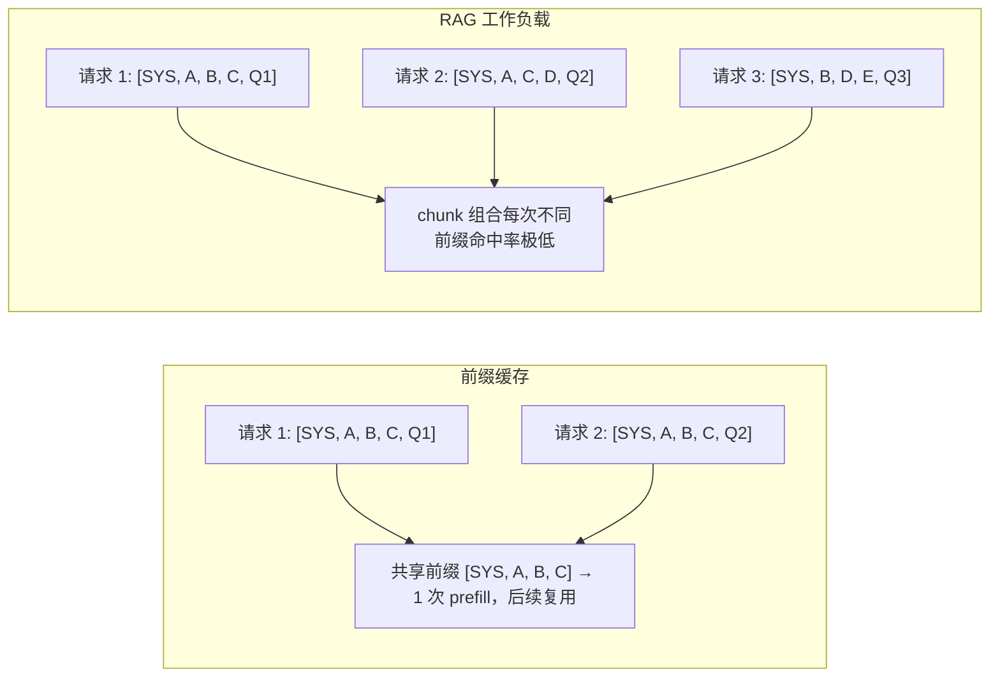
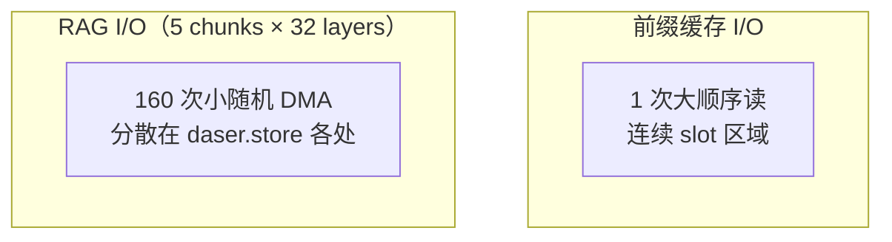
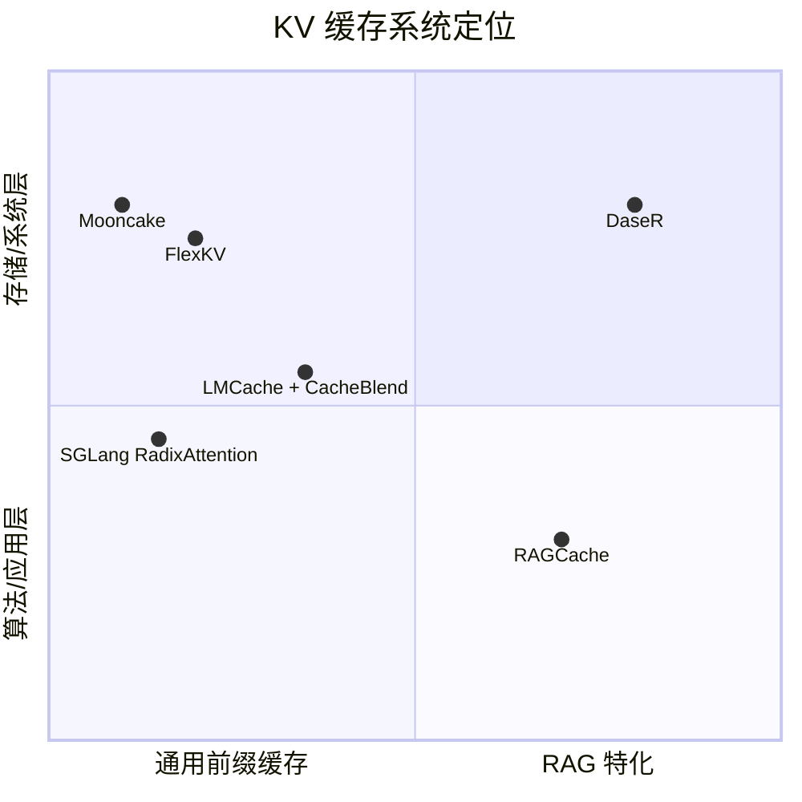
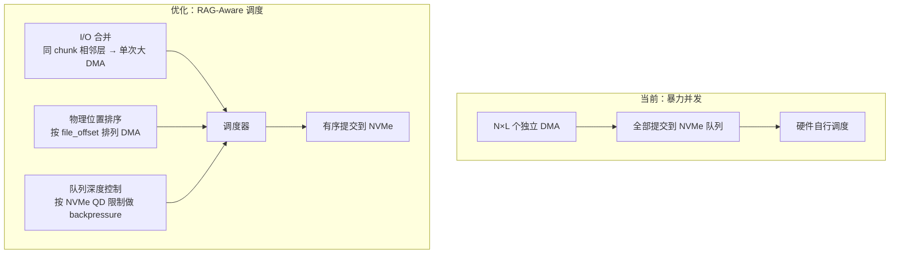
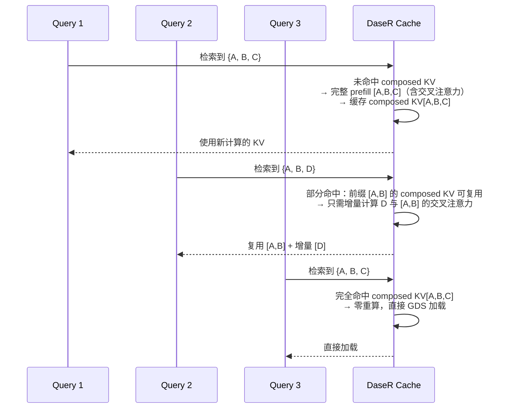
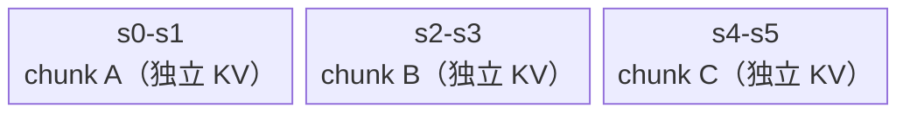
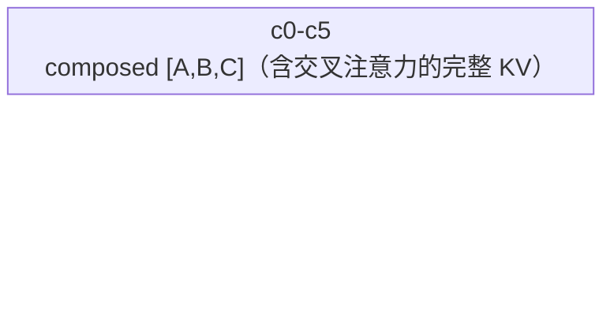
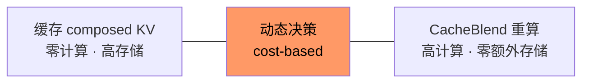

# 研究动机：RAG 与前缀缓存的根本差异

## 一、问题观察

现有 KV 缓存系统（LMCache、FlexKV、SGLang RadixAttention）均为**前缀缓存**设计。前缀缓存的假设是：多个请求共享相同的 prompt 前缀，只需对公共前缀计算一次 KV 并复用。

RAG 工作负载打破了这一假设：



### 差异一：I/O 访问模式完全不同

前缀缓存从 NVMe 加载 KV 是一次连续顺序读（一个长前缀的所有层）；RAG 需要同时加载 N 个独立 chunk，每个 chunk 有 L 层，产生 N×L 次小的随机读。



| 维度 | 前缀缓存 | RAG |
|------|---------|-----|
| 读取次数 | 1（连续前缀） | N × L（N chunks，L layers） |
| I/O 大小 | 大（整个前缀的 KV） | 小（单个 chunk 的单层 KV） |
| 访问模式 | 顺序 | 随机 |
| NVMe 队列利用 | 低（单次大 I/O） | 高（大量并发小 I/O） |
| 典型数量级 | 1 次 DMA | 5 chunks × 32 layers = 160 次 DMA |

### 差异二：独立 chunk KV 缺乏交叉注意力

每个 chunk 的 KV 是独立 prefill 计算的，chunk 内的 token 在计算 KV 时不知道其他 chunk 的存在：

```
理想：KV_ABC = Attention(Q, [tokens_A, tokens_B, tokens_C])  ← A、B、C 之间有交叉注意力
实际：[KV_A, KV_B, KV_C] = [Attn(Q,A), Attn(Q,B), Attn(Q,C)]  ← 各自独立，无交叉注意力
```

CacheBlend（EuroSys'25）通过选择性重算部分 attention 层来修正，但：
- 每次组合都需要重算，即使完全相同的组合之前出现过
- 重算层的选择是静态的，不感知具体 chunk 内容
- 重算结果不被缓存，下次同组合仍需重算

### 差异三：前缀缓存的命中条件过于严格

前缀缓存只在 token 序列完全相同时命中。RAG 中即使检索到相同的 chunk 集合，只要排列顺序不同，就是不同的前缀，无法命中：

```
请求 1 prompt: [SYS, chunk_A, chunk_B, chunk_C, query_1]  → 缓存
请求 2 prompt: [SYS, chunk_A, chunk_C, chunk_B, query_2]  → 完全 miss（B、C 交换）
```

---

## 二、核心论点

**现有 KV 缓存系统在为前缀缓存设计的 I/O 策略和索引结构上运行 RAG 工作负载，导致三个层面的低效：**

1. **存储 I/O 层**：大量小随机读未经合并或调度优化，NVMe 带宽利用率低
2. **缓存策略层**：仅缓存独立 chunk KV，不缓存含完整交叉注意力的 composed KV，相同组合反复重算
3. **索引层**：精确前缀匹配对 RAG 的组合复用无效，命中率低

DaseR 的目标是在这三个层面上为 RAG 工作负载做针对性优化。

---

## 三、相关工作

### 3.1 KV 缓存系统

| 系统 | 部署模式 | NVMe/GDS | vLLM 集成 | 用户侧 API | RAG 支持 |
|------|---------|----------|----------|-----------|---------|
| **LMCache** | 进程内库 + FastAPI | GDS/cuFile | `KVConnectorBase_V1` | 运维/观测 API | CacheBlend |
| **Mooncake** | 库 + 分布式服务 | SSD 分层 | KV Connector（官方） | 无 | 无 |
| **SGLang** | 进程内 RadixAttention | 通过 HiCache | 独立引擎 | 无 | 自动前缀缓存 |
| **FlexKV** | 进程内库 | GDS + io_uring | `FlexKVConnectorV1` | 无 | 无 |
| **NIXL** | 进程内库 | NVMe 插件 | 传输后端 | 无 | 无 |
| **Dynamo** | 编排服务 | 通过后端 | 路由层 | 推理路由 API | 无 |

**共同特征**：所有系统将 NVMe 视为简单的读写后端，I/O 调度依赖操作系统或硬件队列。没有系统针对 RAG 的多 chunk 并发随机读做过存储层优化。

### 3.2 RAG KV 复用研究

| 论文 | 会议 | 核心贡献 | 局限 |
|------|------|---------|------|
| **CacheGen** | SIGCOMM'24 | KV 张量压缩传输 | 面向网络传输，不涉及 NVMe 存储 |
| **CacheBlend** | EuroSys'25 | 独立 chunk KV 拼接，选择性重算部分层修正交叉注意力 | 重算层选择静态；结果不缓存 |
| **RAGCache** | ATC'24 | Knowledge Tree 多级缓存 | 无 GDS/NVMe；树结构仅支持前缀 |
| **MemServe** | arXiv'24 | 分布式 KV 内存池 + 跨实例 attention | 侧重分布式，不涉及持久化存储 |

### 3.3 DaseR 的定位



DaseR 定位于**高 RAG 特化 × 高系统深度**象限——在 GDS/NVMe 存储层为 RAG 工作负载做针对性优化，而非在算法层做通用改进。

---

## 四、研究路线图

### 4.1 总体目标

```
DaseR: 面向 RAG 工作负载的 GDS-Native KV 缓存系统

Observation:
  RAG 的 KV 访问模式（多 chunk 并发随机读、高组合重叠、需要交叉注意力）
  与前缀缓存根本不同，但现有系统没有针对性优化。

Contribution 1 (系统):
  GDS I/O 调度器 — 针对 RAG 多 chunk 并发读的 I/O 合并、
  分层预取、物理位置感知排序。

Contribution 2 (研究):
  Composition-aware caching — 缓存高频 chunk 组合的 composed KV
  （含完整交叉注意力），在重复组合时实现零重算。

Contribution 3 (系统+研究):
  动态缓存策略 — 在 composed KV 缓存与 CacheBlend 式重算之间
  做 cost-based 决策，平衡存储空间与计算开销。

评估:
  在 RAG benchmark 上测 TTFT、throughput、answer quality，
  对比 LMCache + CacheBlend baseline。
```

### 4.2 Contribution 1：RAG-Aware GDS I/O 调度

**问题**：当前 `start_load_kv` 将 N×L 个 DMA 请求通过 `asyncio.gather` 全部并发提交，依赖 NVMe 硬件队列调度。这对 RAG 的大量小随机读并不高效。

**优化方向**：



**具体优化点**：

| 优化 | 描述 | 预期收益 |
|------|------|---------|
| **I/O 合并** | 同一 chunk 的 L 层在 `daser.store` 中物理连续（slot 内部按层排列），可合并为 1 次大 DMA | 将 N×L 次 DMA 降至 N 次 |
| **物理位置排序** | 将多个 chunk 的 DMA 请求按 `file_offset` 升序排列后提交 | 减少 NVMe 内部 seek，提高顺序访问比例 |
| **队列深度控制** | 根据 NVMe 设备 QD 限制（通常 32-128），分批提交而非一次性全部提交 | 避免队列溢出导致的延迟波动 |
| **分层预取** | 高频 chunk 常驻 GPU/CPU 内存，中频走 CPU→GPU 拷贝，低频才走 NVMe GDS 读取 | 减少 NVMe 访问次数 |

**评估指标**：单次 `start_load_kv` 延迟（P50/P99）、NVMe 带宽利用率（实际 vs 理论峰值）、IOPS。

### 4.3 Contribution 2：Composition-Aware Caching

**问题**：现有系统只缓存独立 chunk 的 KV，不缓存 chunk 组合的 composed KV。CacheBlend 每次都重算交叉注意力修正，即使相同组合之前已出现过。

**核心 idea**：识别高频 chunk 组合，缓存其含完整交叉注意力的 composed KV。



**关键设计决策**：

1. **缓存粒度**：以有序 chunk 组合（如 `[A,B,C]`）为 key，composed KV 为 value
2. **部分命中**：如果缓存了 `[A,B,C]`，查询 `[A,B,D]` 时，`[A,B]` 是公共前缀，其 composed KV 可直接复用（因为在原始 prompt 中 A、B 的 KV 包含了 A↔B 的交叉注意力），只需计算 D 的增量
3. **淘汰策略**：组合空间是指数级的，不可能全部缓存。需要基于访问频率和重算代价的淘汰策略：
   - `缓存价值 = 访问频率 × 重算代价（chunk 数 × 层数 × token 数）`
   - 高价值组合保留在 NVMe，低价值组合只保留独立 chunk KV
4. **与独立 chunk KV 的关系**：独立 chunk KV 是 composed KV 的构建材料。首次见到新组合时，先从独立 KV + CacheBlend 拼接（或完整 prefill），然后决定是否缓存结果

**存储布局扩展**：




独立 chunk KV 和 composed KV 共享同一个 ring buffer，由 ChunkManager 统一管理。

### 4.4 Contribution 3：动态缓存策略

**问题**：存储空间有限，不可能缓存所有 chunk 组合。需要在两个极端之间做 cost-based 决策。



**建模**：

对于一个 chunk 组合 S = {c₁, c₂, ..., cₙ}：
- **缓存收益** = `P(S) × T_recompute(S)`，其中 `P(S)` 是组合 S 的未来访问概率，`T_recompute(S)` 是 CacheBlend 重算延迟
- **缓存代价** = `size(S) × T_evict`，即 composed KV 占用的存储空间导致其他缓存被淘汰的代价
- **决策**：当 `收益 > 代价` 时缓存 composed KV，否则依赖独立 chunk KV + CacheBlend

**实现**：在 ChunkManager 中维护组合访问计数器，定期评估并决定：
- 哪些组合值得缓存 composed KV
- 哪些组合只保留独立 chunk KV
- 何时从 composed KV 降级到独立 KV（访问频率下降时释放空间）

### 4.5 评估计划

| 维度 | 指标 | Baseline |
|------|------|----------|
| **延迟** | TTFT（首 token 延迟）P50/P99 | LMCache + CacheBlend |
| **吞吐** | 请求/秒 | LMCache + CacheBlend |
| **I/O 效率** | NVMe 带宽利用率、IOPS | 当前 DaseR（暴力 gather） |
| **缓存效率** | composed KV 命中率、存储利用率 | 纯独立 chunk KV 缓存 |
| **质量** | RAG answer accuracy（缺失交叉注意力的影响） | 完整 prefill（上界） |

**Benchmark**：
- 工作负载：多轮 RAG 查询（chunk 组合有重叠），如 NarrativeQA、HotpotQA
- 模型：Llama-3-8B / 70B
- 硬件：NVIDIA GPU + NVMe SSD（GDS enabled）

**目标会议**：ATC / EuroSys / MLSys
